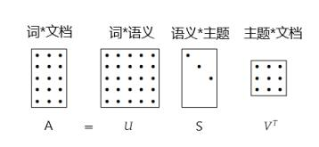

# LSA

### 算法流程  
    1. 去标点符号和stopword
    2. 分词  
    3. 构造 词-文档 矩阵A
    4. 奇异值分解SVD,   保留90%的特征
    
    5. 应用场景
        a. 推荐:  直接用Vt（topic-文档矩阵）求相似度
        b. 搜索:  通过查询条件Xq构造伪文档矩阵Dq,  利用Dq和Vt 求余弦相似度.

### 语义搜索
    比如一个文档集合有索引词{T1,T2,T3}，伪文本为t1,t3,t2,t1，则Xq={2,1,1}。
    获得Xq后，通过公式 Dq = Xq U S-1  计算伪文档（主题*1)。其中U和S分别代表
    奇异分解中得到的矩阵(S = U S Vt).注意上面的公式中S-1代表S的逆矩阵
